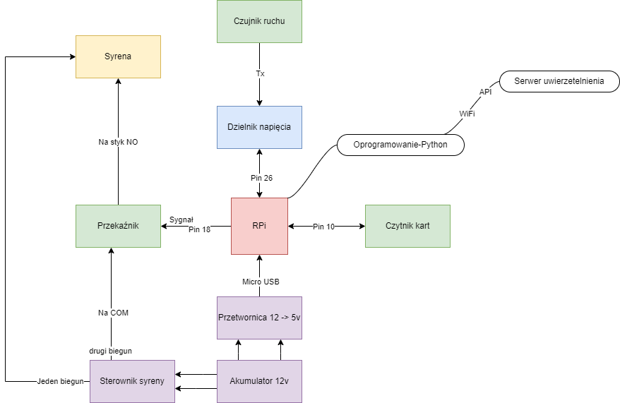

# RDM6300 rfid alarm 

System oparty o RPi 3b+, czytnik rfid 125khz rdm6300, czujnik ruchu PIR HC-SR501, przekaźnik oraz posiadaną wsześniej syrenę z modulatorem. Całość zasilana jest z 12 voltowego akumulatora z przetwornicą do zasilania RPi 

# Table of contents

- [Powstawanie](#Powstawanie)
  - [Problemy](#w-trakcie-procesu-powstawanie-napotkałem-całkiem-sporo-problemów)
    - [`Problemy z odczytem rfid`](#problemy-z-odczytem-rfid)
    - [`Problem z sprawedzeniem na serwerze odczytanych kart rfid`](#problem-z-sprawedzeniem-na-serwerze-odczytanych-kart-rfid)
    - [`Problem z zasterowaniem przekaźnika`](#problem-z-zasterowaniem-przekaźnika)
- [Plany na Rozwój](#dalszy-rozwój)
- [Contributing](#contributing)

# Wykorzystane elementy
#### Z założenia miał być to prosty projekt. Składa się on z:
| Element      | Szczegóły | Przykładoy artykuł| 
| ----------- | ----------- | -----------------|
| Mikrokomputer      | Raspberry Pi 3B+       |https://cutt.ly/QwBooHAO|
| Czytnik kart 125kHz  | RDM6300        |https://cutt.ly/mwBoo0Vw|
|Czujnik ruchu| PIR HC-SR501      |https://cutt.ly/UwBoo5fg|
|Przekaźnik| napięcie 3.3V       |https://cutt.ly/uwBopiY6|
|Dioda LED|Opcjonalne|https://cutt.ly/fwBomeOj|
|Rezystor|2x 1kΩ|https://cutt.ly/GwBopXaX|
|Syrena|Opcjonalne|Jakakolwiek syrena 12V|

*Powyższe linki nie są linkami sponsorowanymi a wskazują tylko na przykładowy egzemplarz części zastosowanej w projekcie*

# Budowa
#### W trakcie budowy pierwszej fazy posłużyłem sie poradnikiem:
>https://mad-tinkerer-me.medium.com/rfid-with-raspberry-pi-on-the-cheap-766ae0b6c97e

#### Autror tego poradnika napisał także bibliotekę, która została wykorzystana w tym projekcie:
>https://github.com/mad-tinkerer/python-rdm6300
1. Podłączenie czytnika 
  <figure>
    
    <figcaption><i>Schemat podłączanie czytnika do RPi</i></figcaption>
</figure>

  #### <mark>Pamiętaj o użyciu dzielnika napięcia, inaczej zostaną uszkodzone piny GPIO na raspberry</mark>
2. Podłączenie czunika ruchu
     
     1. Pin GND połączyc z masą RPi
     2. Pin VCC połączyć z magistralą 5v
     3. Pin OUT podłączyć do 26 pinu RPi
   
4. Podłączenie przekaźnika
   1.  Podłączyć pin "+" do pinu pinu 3.3v
   2.  Podłączyc pin "-" do masy 
   3.  Podłączyc pin "S" do w naszym przypadku pinu 18
5. Podłączyc diode sygnalizującą
   1. Pin "-" do masy
   2. Pin "R" do pinu 38
   3. Pin "G" do pinu 40
# Powstawanie

[(Back to top)](#table-of-contents)

Od pojawienia się pomysł wielkorotnie ewoluował. Zaczęlo się od prostego proojektu ze switch case opartym o czytnik rdm6300 i arduino nano. 

1. Schemat pierwszego zamysłu:

    *Zakładał on zasilenie arduino przez pin `vin` oraz komunikacje za pomoca portu szeregowego przy użyciu skrętki, dodatkowo przewodem tym miało lecieć zasilanie syreny*

2. Po analizie szkicu doszliśmy do wniosku iż plan jest nie optymalny oraz zaczęliśmy analizowac dodatkowe funkcje które mogły by byc przydatne:

    *Na tym etapie rozważaliśmy użycie NodeMCU by zastąpić arduino oraz zyskać komunikacje bezprzewodową dzięki modułowi ESP8266*

3. Nastepnie biąrąc pod uwage oczekiwane rezulataty zdecydowaliśmy o przejsciu na wykorszystanie mikrokomputera raspberry PI w wersji posiadanej (3b+):

*Model RPi użyty w projekcie*
4. Po dostosowaniu projektu całość została złożona w jeden układ:

*Złożony jeszcze prototypowo lecz w pełni układ alarmu*

*Schemat ideowy połączeń*
# Schemat działania

[(Back to top)](#table-of-contents)

1. Czujnik ruchu wykrywa ruch
2. Program odpytuje serwer o to czy alarm jest uzbrojony
3. Jeśli alarm jest uzborjony uruchamia się czytnik kart
4. W przeciwnym przypadku przekaźnik od syrwny jesy wyłączany
5. Jeśli kartę przyłożono, zczytane ID jest wysyłane na serwer i walidowane
6. W przypadku pozytywnej weryfikacji program zasypia na 2 minuty, po ich upływie wydaje dźwięk i czeka jescze 30s przed ponowym sprawdzeniem stanu alarmu na serwerze
7. Jeśli walidacja nie przeszła pomyślnie alarm uruchamia sie na 30s
8. Program działa w pętli 
## W trakcie procesu powstawanie napotkałem całkiem sporo problemów

### Problemy z odczytem rfid

<figure>
    
    <figcaption><i>Zbudowany układ do testu odczytów</i></figcaption>
</figure>

#### Uruchomienie czytnika na RPi miało być bajecznie proste, ot pobierasz bibliotekę, uruchamiasz przykład i działa. Lecz nie tym razem, w konsoli wita nas komunikat: 

>WARNING:root:[/dev/ttyS0] got trash resetting rfid read to assume we are at the beginning

<figure>
    
    <figcaption><i>Komunikat błędu wyświetlany w konsoli</i></figcaption>
</figure>

#### Poszukiwanie błędów rozpocząłem od sprawdzenia baud-u portu szeregowego. Zgodnie z dokumentacją modułu rdm6300 baud to 9600. Po sprawdzeniu biblioteki – ślepy trop, biblioteka sama ustawia prawidłową częstotliwość.

- Funkcja z biblioteki rdm6300
  
  

- Po kilku próbach sukces – udaje się, jest odczyt. Niestety działa raz:
  
  *Pojedyńczy prawidłowy odczyt w morzu błędów*

#### Kolejny etap to dalsza analiza biblioteki. Wynika z niej, że oczekuje ona na odczytanie 0x02 – oznacza ono początek ID karty i 0x03, które oznacza koniec transmisji. Wszystko co zostało odebrane pomiędzy zamieniane jest na znaki zgodnie z tablicą ASCII. Skoro więc otrzymujemy błąd oznacza to, że odczytujemy coś co nie pasuje do patternu biblioteki. 

- Aby podejrzeć co odbieramy użyjemy narzędzia minicom (pip install minicom) z poleceniem 
  >minicom -b 9600 -H -o -D /dev/ttyS0

- Jeden z odczytów
  
  *Zawartość błędnie odczytana przez czytnik*

- Inny odczyt
  
  *Inna treść, nadal nie to czego szukamy*

- Prawidłowy odczyt udany za którymś razem: 
  
  *Sukces, mamy to czego poszukiwaliśmy*

#### Przy dalszej obserwacji okazało się, że skrypt działa poprawnie tylko i wyłącznie, gdy na raspberry świeci się czerwona dioda pwr:

  <figure>
    
    <figcaption><i>Zaznaczona dioda, która musi się świecić</i></figcaption>
</figure>

#### Rozwiązaniem okazało sie przełączenie zasilania na zasilacz podający na wyjściu 5.35v

### Problem z sprawedzeniem na serwerze odczytanych kart rfid
  
1. Po przyłożeniu karty do czytnika odczytany powienen zostac identyfikator (tag) karty
  
  *Prawidłowo odczytany i zdekodowany tag karty*

2. Odczytany tag powinien zostac wysłany zapytaniem POST do serwera i na podstawie kodu odpowiedzi powinna zostac podjęta decyzja o dalszym postępowaniu 
- Kod 204 - Użytkownik uwierzetelniony w systemie
- Kod 422 - Użytkownik nie znajduje się w bazie danych, błąd
  
3. W naszym przypadku odpowiedzią był kod 415
   > 415 Unsupported Media Type
  <figure>
    
    <figcaption><i>Błąd zwracany przez serwer</i></figcaption>
  </figure>

    Oznacza on, że serwer odmawia przyjęcia żądania, ponieważ format ładunku jest w nieobsługiwanym formacie.
    Po krótkich poszukiwaniach znalazłem informację, że:
  >Problem z formatem może wynikać ze wskazanego Content-Type lub Content-Encoding żądania lub w wyniku bezpośredniej inspekcji danych.

- Po wypisaniu dokładniejszej informacji pokazuje się taki zapis:
 
 *Zapis błędu zwracanego przez serwer*
 
  Na nasze szczęście pokazuje on główną przyczyne błędu i rozwiązanie, trzbe zmienić header `content-type` z `application/json` na `application/ld+json`.

- Po zmianie nagłówka zapytanie zaczęło działać.
  
  *Prawidłowa odpowiedź uzyskana z serwera*

### Problem z zasterowaniem przekaźnika
  
# Dalszy rozwój

[(Back to top)](#table-of-contents)

### W planach jest dalszy rozwój projektu

#### Rozbudowa funkcjonalności serwera
- [ ] Dodanie logów osób autoryzowanych
- [ ] Wysyłanie maila w momencie błędnej autoryzacji/wywołania alarmu

# Contributing

[(Back to top)](#table-of-contents)

### Autor: 
- BOT_Siwy

### Backend:
- paffcio

### Wsparcie merytoryczne i debugowanie:
- rbml
- mz